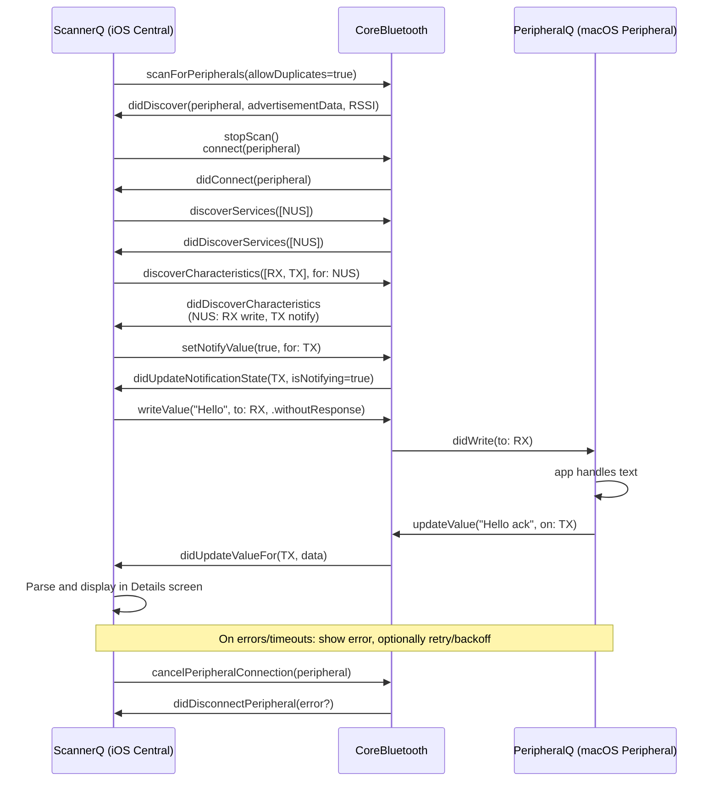
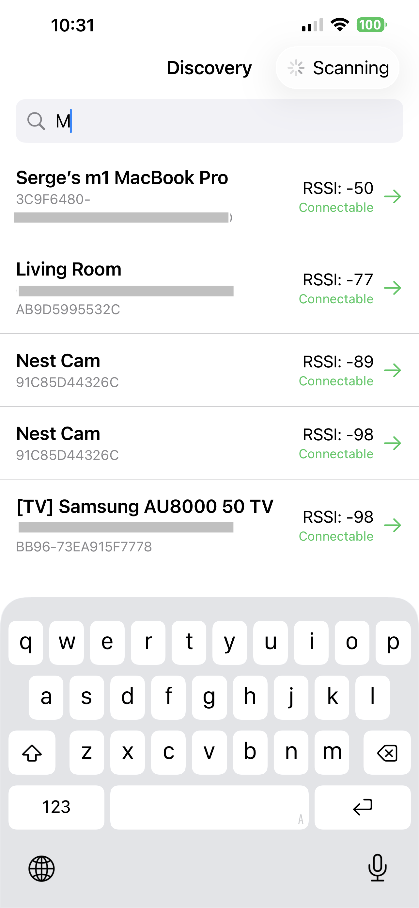
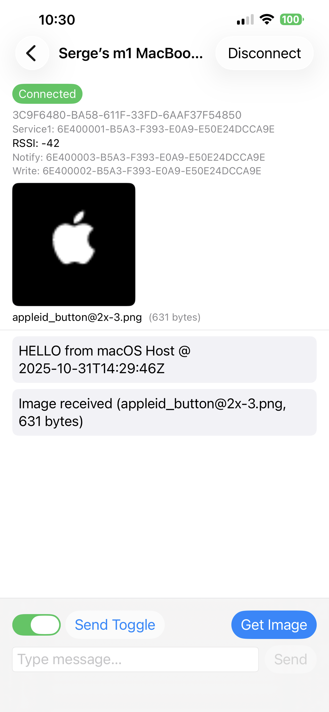
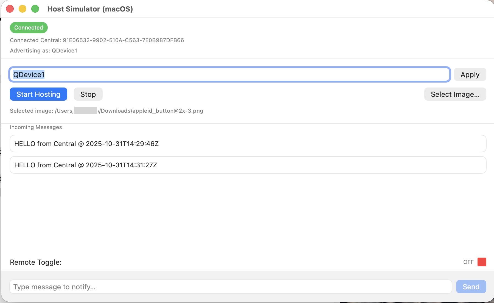

# BLE Interaction (iOS + macOS peer)

This repository contains two SwiftUI apps that demonstrate Bluetooth Low Energy (BLE) interaction using CoreBluetooth:
- ScannerQ (iOS): acts as a Central – scans, discovers, connects, and exchanges simple text payloads.
- PeripheralQ (macOS): acts as a Peripheral – advertises and responds to simple text commands.

Developed and tested with: Xcode 26, iOS 26, macOS 26.

## 1) Architecture and Approach

- Architectural style: MVVM + Repository
  - View (SwiftUI): `ScannerQ/UI/*` and `PeripheralQ/PeripheralView.swift`
  - ViewModel (Combine): `DiscoveryViewModel`, `DetailsViewModel`, `InitViewModel`
  - Repository: `ScannerQ/Repositories/BluetoothRepository.swift` encapsulates CoreBluetooth central logic.
- Modules
  - CommonLibrary: shared types and small helpers (e.g., `BluetoothDevice`, protocol mappers, string utils).
  - ScannerQ: iOS app (Central role).
  - PeripheralQ: macOS app (Peripheral role), see `PeripheralQ/MacHostPeripheral.swift`.
- Combine usage
  - ViewModels expose `@Published` state for device lists, selection, and connection status.
  - Repository emits discovery/connection updates via Combine publishers that ViewModels subscribe to.
  - SwiftUI views react to state changes automatically.
- SwiftUI
  - Declarative UI with simple, focused screens: discovery list, details/interaction, splash/init.
  - Reusable components such as `DeviceRowView`.

## 2) Known Limitations and Potential Improvements

- Duplicate advertising names / connection quirk (known issue)
  - PeripheralQ currently advertises as both `QDevice1` and as the Mac's public name. Both appear in the iOS Discovered devices list.
  - iOS app fails to connect to `QDevice1`, but successfully connects and interacts when the device with the Mac's public name is selected.
  - Workarounds: select the device entry that shows the Mac's public name.

- Permissions and privacy prompts
  - BLE requires Bluetooth permission. On first launch, iOS prompts appear; denial blocks functionality.
  - Improvement: add a dedicated permissions screen with rationale and links to Settings if permission is denied.

- Background behavior
  - Current sample targets foreground use. Background scanning/advertising is limited and not tuned.
  - Improvement: adopt background modes where appropriate and implement reconnection policies with timers.

- Error handling and retries
  - Errors are surfaced minimally. Connection timeouts, characteristic discovery failures, and write errors could be handled more granularly.
  - Improvement: structured error types, exponential backoff retries, and user-facing toasts/alerts.

- Data protocol and reliability
  - Simple text messages only.
  - Improvement: define a small text/binary protocol with sequence IDs, ACK/NACK, and retry.

- UI/UX polish
  - Minimal UI aimed at demonstration.
  - Improvements: filter/search devices, badges for RSSI, connection state indicators, and clearer empty/error states.

- Testing
  - No automated tests.
  - A few stubs for preview.
  - Improvements: unit tests for `TextProtocolParser`, repository fakes for CoreBluetooth, and snapshot tests for views.

## 3) How to Run

Prerequisites
- Xcode 26
- A Mac with Bluetooth for the PeripheralQ app
- A real iPhone to run ScannerQ

Recommended order: start the macOS Peripheral first, then the iOS Scanner.

A) Run the macOS Peripheral (PeripheralQ)
1. Open the project in Xcode.
2. Select the `PeripheralQ` scheme.
3. Go to the Signing & Capabilities tab.
4. Under Signing, set the Team to your Apple Developer Team.
5. Update the Bundle Identifier to a unique identifier (e.g., com.yourcompany.peripheralq).
6. Choose "My Mac" as the run destination.
7. Run. Click 'Start Hosting' to start advertising. You may see both `QDevice1` and your Mac's public name from the iOS app.

B) Run the iOS Scanner (ScannerQ)
1. In Xcode, select the `ScannerQ` scheme.
2. Go to the Signing & Capabilities tab.
3. Under Signing, set the Team to your Apple Developer Team.
4. Update the Bundle Identifier to a unique identifier (e.g., com.yourcompany.scannerq).
5. Choose an iPhone device (physical device recommended for real BLE discovery).
6. Run the app.
7. Grant Bluetooth permission when prompted.
8. Wait for the device list to populate. If both QDevice1 and your Mac's name appear, select the entry with your Mac's public name to connect successfully.
9. The app will navigate to the details/interaction screen, attempt to connect automatically, and exchange handshake hello messages with the simulator.
10. You can send sample text messages in both directions.
11. Select an image in the simulator (PNG files around 1K in size work best), then press the "Get Image" button on the iPhone.
12. Toggle the switch on the iPhone, send it, and observe the remote toggle change state on the Mac.

Troubleshooting
- If no devices appear:
  - Ensure the macOS Peripheral app is running and Bluetooth is enabled on both devices.
  - Toggle Bluetooth off/on on the Mac and iPhone.
  - Kill and relaunch the apps to clear transient CoreBluetooth state.
- If connection to `QDevice1` fails:
  - Select the device entry showing the Mac's public name instead (known limitation above).
- If permissions were denied:
  - Go to iOS Settings > Privacy & Security > Bluetooth and enable access for the app.

## 4) Connect & I/O sequence

The diagram below shows the typical end-to-end flow from discovery to text I/O between the iOS central (ScannerQ) and the macOS peripheral (PeripheralQ).

Key notes
- RX is the characteristic the central writes to (Peripheral receives data).
- TX is the characteristic the central subscribes to (Peripheral notifies data).
- The sample uses Write Without Response for throughput and TX notifications for inbound data.
- Preferred service is Nordic UART Service (NUS) to keep the demo simple and familiar.

## Known GATT service and characteristic UUIDs

These values are defined in `CommonLibrary/BluetoothProtocolSpec.swift` and used by both apps.

- Service: Nordic UART Service (NUS)
  - UUID: `6E400001-B5A3-F393-E0A9-E50E24DCCA9E`
- Characteristic: NUS RX (central writes → peripheral receives)
  - UUID: `6E400002-B5A3-F393-E0A9-E50E24DCCA9E`
  - Properties (Peripheral side): Write, Write Without Response
- Characteristic: NUS TX (peripheral notifies → central receives)
  - UUID: `6E400003-B5A3-F393-E0A9-E50E24DCCA9E`
  - Properties (Peripheral side): Notify

Code references
- `Gatt.Service.nusServiceUUID`
- `Gatt.Characteristic.nusRXUUID`
- `Gatt.Characteristic.nusTXUUID`

## Repository Highlights
- CommonLibrary
  - `Sources/CommonLibrary/BluetoothDevice.swift`: value type representing discovered peripherals.
  - Protocol parsing and mapping helpers.
- ScannerQ (iOS Central)
  - `Repositories/BluetoothRepository.swift`: CoreBluetooth central logic and Combine publishers.
  - `UI/Discovery/DiscoveryScreenView.swift`, `UI/Details/DetailsScreenView.swift`, `UI/Components/DeviceRowView.swift`.
  - `UI/*ViewModel.swift`: MVVM state and side-effects.
- PeripheralQ (macOS Peripheral)
  - `MacHostPeripheral.swift`: advertising/services implementation.
  - `PeripheralView.swift`: minimal UI surface.

## ScannerQ Screenshots 

<table>
  <tr>
    <td>Discovery</td>
    <td>Details</td>
  </tr>
  <tr>
    <td></td>
    <td></td>
  </tr>
 </table>

## PeripheralQ Screenshots

<table>
  <tr>
    <td>PeripheralQ</td>
  </tr>
  <tr>
    <td></td>
  </tr>
 </table>

## 📞 Contact
- **[Sergey N](https://www.linkedin.com/in/sergey-neskoromny/)**